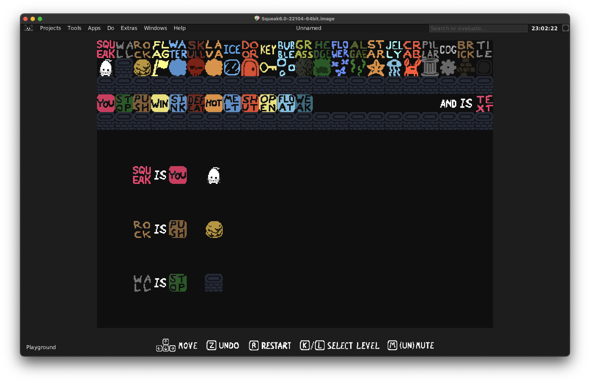
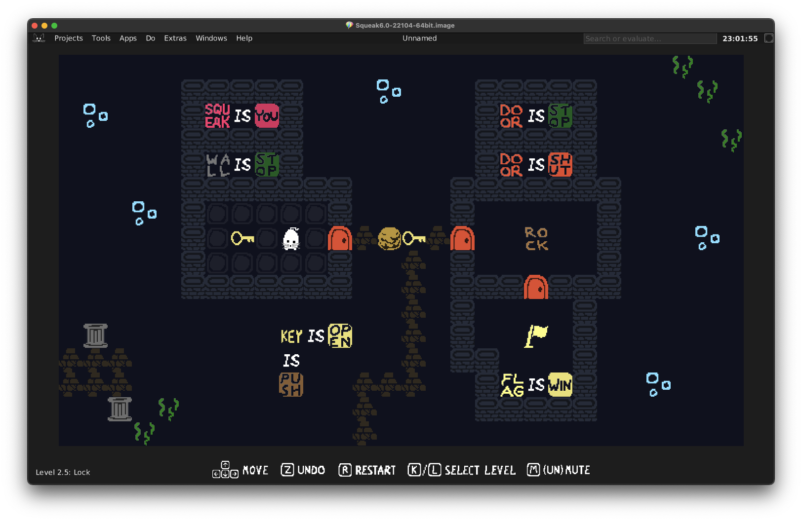
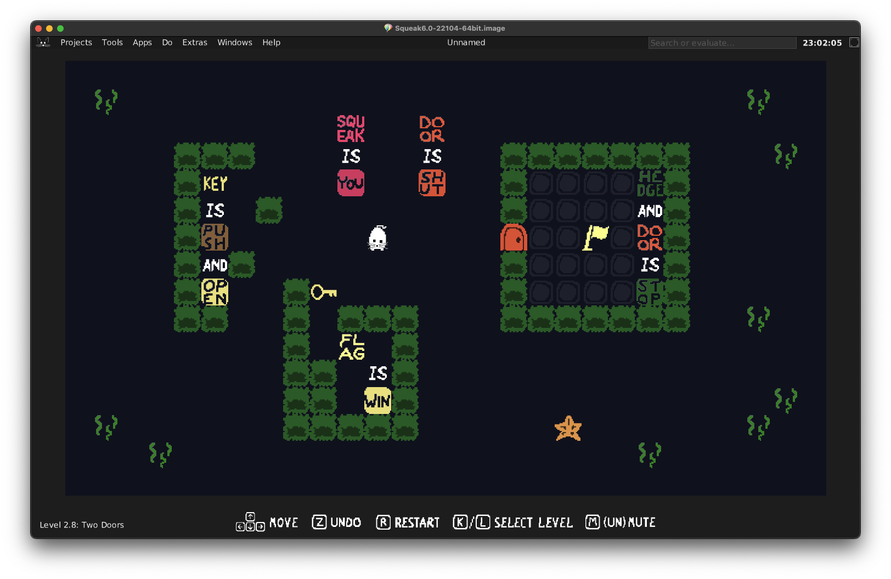
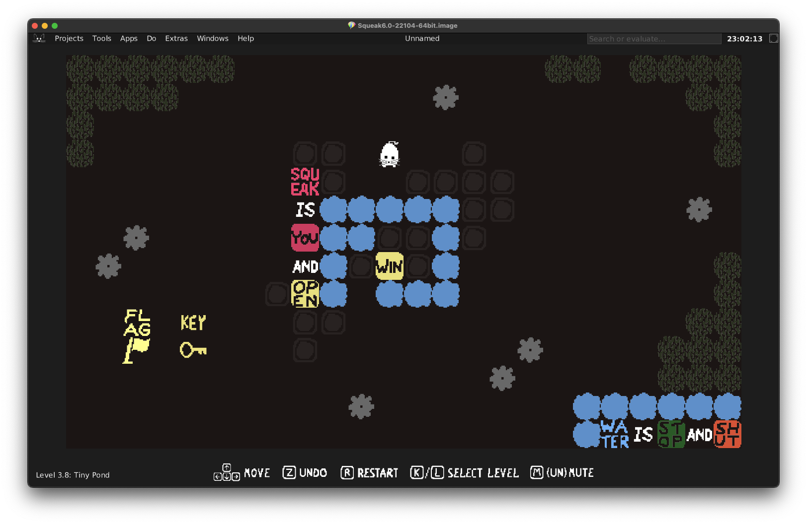

  
  

## Installation ⚙️

1. Download the newest version of _Squeak Is You_ on the [releases page](https://github.com/hpi-swa-teaching/Squeak-Is-You/releases/).
2. Drag and drop the `.sar`-file into your Squeak image, then select `install SAR`.

## How To Play 🎮

To start the game in fullscreen, open a workspace and run `SIYGame start`. If you don't want to run the game in fullscreen, run `SIYGame startWithScale: 1.0` instead.

| **Key**              | **Function**                     |
| -------------------- | -------------------------------- |
| `WASD` or Arrow Keys | move _isYou_-blocks              |
| `Z`                  | undo                             |
| `R`                  | restart level                    |
| `K` / `L`            | previous / next level            |
| `M`                  | mute music / sound               |
| `ESC`                | exit game _(only in fullscreen)_ |

## Hints & Solutions 💡

If you get stuck on a level, take a look at [Baba Is Hint](https://www.keyofw.com/baba-is-hint), which aims to give hints as spoiler-free as possible.

Check out the [Baba Is You Wiki](https://babaiswiki.fandom.com/wiki/Baba_Is_You_Wiki). It contains solutions for all levels and explains exactly how all rule blocks work.

## Build Your Own Levels 🛠️

The game is compatible with the Morph Halo: Blocks can be duplicated, deleted and moved via the Halo. Combined with the `Playground` level (which contains all implemented blocks) this feature can be used for level prototyping and experimenting.

## Trailer 🎥

_(work in progress)_

## Screenshots 🖼️

  
   
   
   

## License 🔑

**_Squeak Is You_ is based on [Baba Is You](https://www.hempuli.com/baba/) by Hempuli (Arvi Teikari).** We have the permission from the original author to publish this project for educational purposes. More information can be found in the [LICENSE.md](LICENSE.md).
